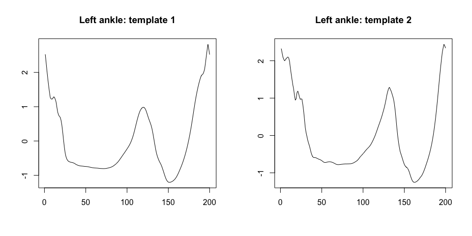

<!-- badges: start -->

[](https://cran.r-project.org/package=adeptdata)
[](https://cran.r-project.org/package=adeptdata)
[](https://cran.r-project.org/package=adeptdata)
[](https://github.com/martakarass/adeptdata/actions)
<!-- badges: end -->

# adeptdata

Package `adeptdata` was created to host raw accelerometry data sets and
their derivatives. Some of them are used in the corresponding `adept`
package.

### Installation

Install from CRAN.

``` r
install.packages("adeptdata")
```

### Data objects

##### Object `acc_running`

The `acc_running` data frame is a sample raw accelerometry data
collected during 25 minutes of an outdoor run. Data were collected at
frequency 100 Hz with two ActiGraph GT9X Link sensors located at left
hip and left ankle. See `?acc_running` for details.

``` r
library(adeptdata)
head(acc_running)
#>     loc_id           date_time      x      y     z
#> 1 left_hip 2018-10-25 17:57:30 -0.199 -1.012 0.133
#> 2 left_hip 2018-10-25 17:57:30 -0.191 -1.027 0.133
#> 3 left_hip 2018-10-25 17:57:30 -0.191 -1.035 0.121
#> 4 left_hip 2018-10-25 17:57:30 -0.191 -1.027 0.109
#> 5 left_hip 2018-10-25 17:57:30 -0.191 -1.016 0.109
#> 6 left_hip 2018-10-25 17:57:30 -0.184 -1.012 0.121
lubridate::tz(acc_running$date_time)
#> [1] "UTC"
```

##### Object `acc_walking_IU`

The `acc_walking_IU` data frame is a sample of raw accelerometry data
collected during outdoor continuous walking from 32 healthy participants
between 23 and 52 years of age. Data were collected at frequency 100 Hz
simultaneously with four wearable accelerometers located at left wrist,
left hip and both ankles. See `?acc_walking_IU` for details.

``` r
head(acc_walking_IU)
#>      subj_id     loc_id time_s      x      y      z
#> 1 id86237981 left_wrist   0.00 -0.270 -0.773 -0.160
#> 2 id86237981 left_wrist   0.01 -0.266 -0.738 -0.172
#> 3 id86237981 left_wrist   0.02 -0.277 -0.707 -0.168
#> 4 id86237981 left_wrist   0.03 -0.277 -0.680 -0.160
#> 5 id86237981 left_wrist   0.04 -0.289 -0.656 -0.160
#> 6 id86237981 left_wrist   0.05 -0.316 -0.641 -0.164
```

##### Object `stride_template`

The `stride_template` is a list containing walking stride pattern
templates derived from accelerometry data collected at four body
locations: left wrist, left hip, left ankle, and right ankle. See
`?stride_template` for details.

``` r
template <- list(stride_template$left_ankle[[2]][1, ],
                 stride_template$left_ankle[[2]][2, ])
par(mfrow = c(1,2), cex = 1)
plot(template[[1]], type = "l", xlab = "", ylab = "", main = "Left ankle: template 1")
plot(template[[2]], type = "l", xlab = "", ylab = "", main = "Left ankle: template 2")
```


