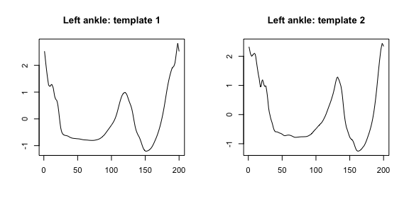

<!-- README.md is generated from README.Rmd. Please edit that file -->

# adeptdata

The goal of `adeptdata` is to host the data used in vignettes for
`adept` R package.

### Installation

``` r
# install.packages("devtools")
devtools::install_github("martakarass/adeptdata")
```

### Example

`acc_running` is a sample raw accelerometry data collected during 25
minutes of an outdoor run. Data were collected at frequency 100 Hz with
two ActiGraph GT9X Link sensors located at left hip and left ankle. See
`?acc_running` for details.

``` r
library(adeptdata)
head(acc_running)
#>        x      y     z       vm           date_time sensor_location
#> 1 -0.199 -1.012 0.133 1.039920 2018-10-25 17:57:30        left_hip
#> 2 -0.191 -1.027 0.133 1.053043 2018-10-25 17:57:30        left_hip
#> 3 -0.191 -1.035 0.121 1.059409 2018-10-25 17:57:30        left_hip
#> 4 -0.191 -1.027 0.109 1.050281 2018-10-25 17:57:30        left_hip
#> 5 -0.191 -1.016 0.109 1.039528 2018-10-25 17:57:30        left_hip
#> 6 -0.184 -1.012 0.121 1.035684 2018-10-25 17:57:30        left_hip
lubridate::tz(acc_running$date_time)
#> [1] "UTC"
```

`stride_template` is a list containing walking stride pattern templates
derived from accelerometry data collected at four body locations: left
wrist, left hip, left ankle, and right ankle. See `?stride_template` for
details.

``` r
template <- list(stride_template$left_ankle[[2]][1, ],
                 stride_template$left_ankle[[2]][2, ])
par(mfrow = c(1,2), cex = 0.7)
plot(template[[1]], type = "l", xlab = "", ylab = "", main = "Left ankle: template 1")
plot(template[[2]], type = "l", xlab = "", ylab = "", main = "Left ankle: template 2")
```


